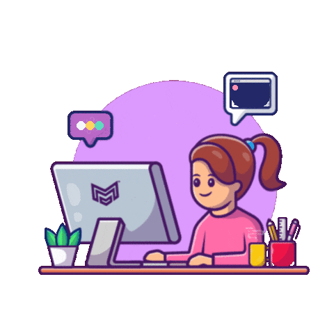
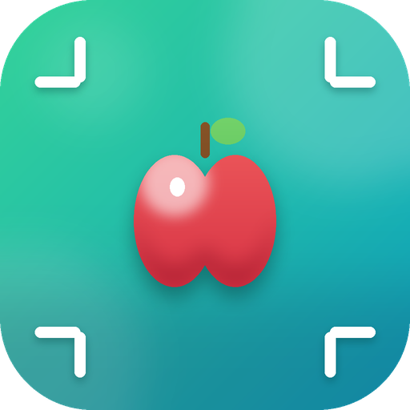

<!-- ✦ Hero Banner ✦ -->

<!-- ✦ Typing Intro ✦ -->

 

&nbsp; 💙 <i>Crafting clean, modern & user-centered digital experiences</i> 💙 &nbsp;

  

<!-- ✦ Shimmering Divider ✦ -->

 

# Hi there! 

<table border="0">
  <tr>
    <td width="60%" valign="top">
      
I'm <b>Jiya</b> — a UI/UX Designer who loves turning messy, complex workflows into clean, intuitive, delightful products. I design <b>mobile apps, responsive websites, dashboards, and business software</b> — end to end, from the first user flow to developer-ready handoff.

      <ul>
        <li>🌍 &nbsp;Worldwide · India</li>
        <li>💼 &nbsp;Freelance UI/UX Designer on <b>Upwork</b> — designing apps, websites & dashboards for clients worldwide</li>
        <li>🎓 &nbsp;BBA in Computer Applications, SPPU — <b>CGPA 8.78</b></li>
        <li>🧠 &nbsp;Big believer in <i>simple &gt; clever</i> — good design should feel invisible</li>
        <li>✨ &nbsp;Currently obsessed with <b>design systems</b> & pixel-perfect handoffs</li>
      </ul>
    </td>
    <td width="40%" align="center">
      
    </td>
  </tr>
</table>

 

#  &nbsp;Let's Connect

&nbsp;

&nbsp;

  

 

#  &nbsp;What I Do

<table>
  <tr>
    <td width="50%" align="center">
       
      
      <h3>Product & App Design</h3>
      
End-to-end design of mobile apps — from research and wireframes to polished, high-fidelity UI.

    </td>
    <td width="50%" align="center">
       
      
      <h3>UX Research & User Flows</h3>
      
User-centric journeys focused on onboarding, engagement, and conversion.

    </td>
  </tr>
  <tr>
    <td width="50%" align="center">
       
      
      <h3>Wireframing & Prototyping</h3>
      
Structured ideas into wireframes and interactive prototypes that tell the product's story.

    </td>
    <td width="50%" align="center">
       
      
      <h3>Design Systems</h3>
      
Scalable systems with typography, color foundations, and reusable components.

    </td>
  </tr>
  <tr>
    <td width="50%" align="center">
       
      
      <h3>Dashboard Design</h3>
      
Dashboards that track projects, users, and workflows — clarity over clutter.

    </td>
    <td width="50%" align="center">
       
      
      <h3>Developer Handoff</h3>
      
Clean specs and close collaboration for smooth, accurate implementation.

    </td>
  </tr>
</table>

 

 

#  &nbsp;Featured Case Studies

<table>
  <tr>
    <td width="50%" align="center">
       
      
      <h3>Girl Thing App</h3>
      
Women-centric social app designed end-to-end — onboarding, home feed & interactive sections built on a scalable design system.

      
        
    </td>
    <td width="50%" align="center">
       
      
      <h3>EmpowHer</h3>
      
A safe, inclusive app for women's empowerment, support & community building — concept to high-fidelity UI.

      
        
    </td>
  </tr>
  <tr>
    <td width="50%" align="center">
       
      
      <h3>FoodieFit</h3>
      
Smart food-scanning app that turns complex nutritional data into clean, easy screens for faster, healthier decisions.

      
        
    </td>
    <td width="50%" align="center">
       
      
      <h3>Laundry App</h3>
      
Urban laundry service app with effortless booking flows, location-based listings & personalized care options.

      
        
    </td>
  </tr>
</table>

 

  

 

#  &nbsp;My Design Toolbox

  

  

 

#  &nbsp;My Design Process

 &nbsp;<b>Research</b>&nbsp;&nbsp;
&nbsp;&nbsp;
 &nbsp;<b>User Flows</b>&nbsp;&nbsp;
&nbsp;&nbsp;
 &nbsp;<b>Wireframes</b>

 

&nbsp;&nbsp;
 &nbsp;<b>Hi-Fi UI</b>&nbsp;&nbsp;
&nbsp;&nbsp;
 &nbsp;<b>Design System</b>&nbsp;&nbsp;
&nbsp;&nbsp;
 &nbsp;<b>Handoff</b> ✨

  

<!-- ✦ Live Animated Flow ✦ -->

 

> ### 💭 *"Good design is invisible — you only notice it when it's missing."*

 

  

**Thanks for stopping by! Let's create something beautiful together** 

<!-- ✦ Footer Wave ✦ -->

*Designed with 💙 by Jiya Rathi*

